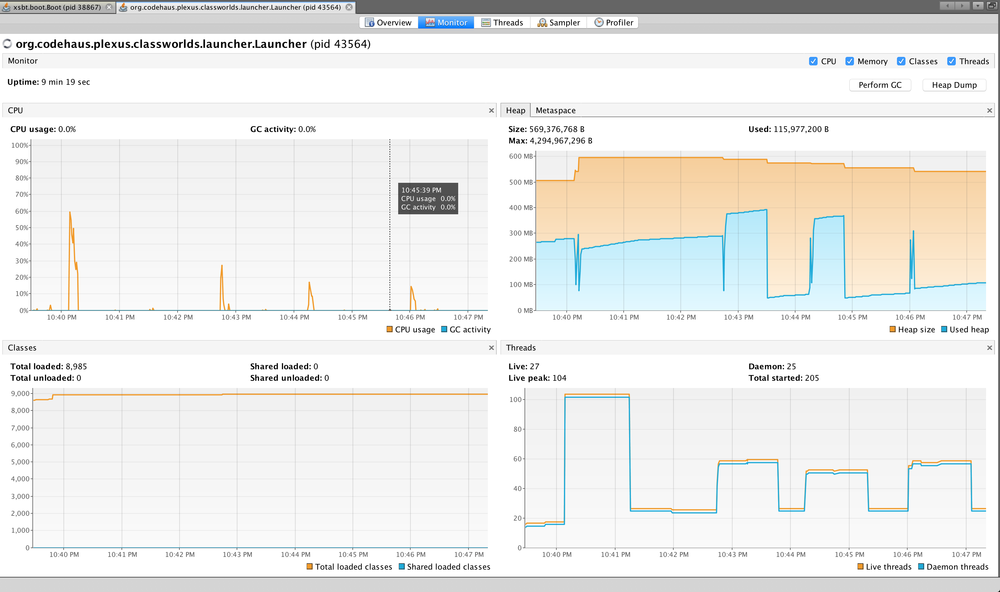

Java HTTP/REST Server
==========================

This is a micro-service baseline in java 12, spring-boot `2.1.x`

```
|                   |                          |
|                   |                          |
|    /endpoint      |      Service             |
|                   |                          |
|                   |                          |
|                   |                          |

```


- [tests](#tests)
- [build/ run-app in x env](#run-app-in-x-env)
- [Deployment + Load balancing](#Deployment-+-Load-balancing)
- [build artifact](#build-artifact)
- [perf](#perf)

tests
-----

```
mvn test
```

build/ [run-app in x env](http://docs.spring.io/spring-boot/docs/current/maven-plugin/examples/run-profiles.html)
----------------------------------------------------------------------------------------------------------

[with `application.properties` configured to `e2e`](http://stackoverflow.com/a/35757421/432903)

```bash

spring.profiles.active=e2e

mvn spring-boot:run
```

or set profile in `pom.xml`.

[BUT the best way is to have environment variable](http://stackoverflow.com/a/35534970/432903),
[that will determine which config to use.](http://stackoverflow.com/a/38337109/432903)

```
export SPRING_PROFILES_ACTIVE=production
```

or

```bash
export APP_ENVIRONMENT=production
spring.profiles.active=${APP_ENVIRONMENT} ##not necessary
```

```bash
curl -v -XGET http://localhost:9000/restapi/health

{
 "id": 1,
 "eventId": "staging",
 "status": "I'm Running"
}

```

or using docker (setup the HTTP_PROXY, HTTPS_PROXY and NO_PROXY)


```bash
mvn clean package
eval $(minikube docker-env) # instead of pushing your Docker image to a registry, you can simply build the image using the same Docker host as the Minikube VM
docker build -t rest-server:v1 .
#docker run -it --rm -p 9000:8080 restapi

kubectl create -f restserver-k8-service.yaml
#kubectl delete service rest-server

kubectl create -f restserver-k8-deployemnt.yaml
#kubectl delete deployment rest-server

kubectl get services
NAME          TYPE        CLUSTER-IP      EXTERNAL-IP   PORT(S)          AGE
kubernetes    ClusterIP   10.96.0.1       <none>        443/TCP          2d
rest-server   NodePort    10.102.228.53   <none>        8080:30035/TCP   5m

minikube service rest-server #expose your Service outside of the cluster
```

https://github.com/redhat-developer-demos/spring-boot-configmaps-demo

Publish artifact/ container image
---------------------------

```
//TODO add syntax to upload to docker-registry
aws s3api put-object --bucket samsa-repo --key restapi-artifcts/restapi.war --body target/restapi.war --region us-west-2 --profile aws-federated
```


REST API deps size

```bash
$ du -sh target/restapi/WEB-INF/lib/spring-*
372K	target/restapi/WEB-INF/lib/spring-aop-4.3.6.RELEASE.jar
748K	target/restapi/WEB-INF/lib/spring-beans-4.3.6.RELEASE.jar
648K	target/restapi/WEB-INF/lib/spring-boot-1.4.4.RELEASE.jar
952K	target/restapi/WEB-INF/lib/spring-boot-autoconfigure-1.4.4.RELEASE.jar
4.0K	target/restapi/WEB-INF/lib/spring-boot-starter-1.4.4.RELEASE.jar
4.0K	target/restapi/WEB-INF/lib/spring-boot-starter-logging-1.4.4.RELEASE.jar
4.0K	target/restapi/WEB-INF/lib/spring-boot-starter-tomcat-1.4.4.RELEASE.jar
4.0K	target/restapi/WEB-INF/lib/spring-boot-starter-web-1.4.4.RELEASE.jar
1.1M	target/restapi/WEB-INF/lib/spring-context-4.3.6.RELEASE.jar
1.1M	target/restapi/WEB-INF/lib/spring-core-4.3.6.RELEASE.jar
260K	target/restapi/WEB-INF/lib/spring-expression-4.3.6.RELEASE.jar
800K	target/restapi/WEB-INF/lib/spring-web-4.3.6.RELEASE.jar
896K	target/restapi/WEB-INF/lib/spring-webmvc-4.3.6.RELEASE.jar
```

Deployment + Load balancing
-----

//TODO using k8s

perf
----

1 - 100K requests
-----------------

```
$ ab -n 100000 -c 100 -k http://127.0.0.1:8080/health
This is ApacheBench, Version 2.3 <$Revision: 1807734 $>
Copyright 1996 Adam Twiss, Zeus Technology Ltd, http://www.zeustech.net/
Licensed to The Apache Software Foundation, http://www.apache.org/

Benchmarking 127.0.0.1 (be patient)
Completed 10000 requests
apr_socket_recv: Operation timed out (60)
Total of 16441 requests completed
```

2 - 10K requests
----------------

```
ab -n 10000 -c 100 -k http://127.0.0.1:8080/health
This is ApacheBench, Version 2.3 <$Revision: 1807734 $>
Copyright 1996 Adam Twiss, Zeus Technology Ltd, http://www.zeustech.net/
Licensed to The Apache Software Foundation, http://www.apache.org/

Benchmarking 127.0.0.1 (be patient)
Completed 1000 requests
Completed 2000 requests
Completed 3000 requests
Completed 4000 requests
Completed 5000 requests
Completed 6000 requests
Completed 7000 requests
Completed 8000 requests
Completed 9000 requests
Completed 10000 requests
Finished 10000 requests


Server Software:
Server Hostname:        127.0.0.1
Server Port:            8080

Document Path:          /health
Document Length:        60 bytes

Concurrency Level:      100
Time taken for tests:   2.804 seconds
Complete requests:      10000
Failed requests:        0
Keep-Alive requests:    0
Total transferred:      1790000 bytes
HTML transferred:       600000 bytes
Requests per second:    3565.86 [#/sec] (mean)
Time per request:       28.044 [ms] (mean)
Time per request:       0.280 [ms] (mean, across all concurrent requests)
Transfer rate:          623.33 [Kbytes/sec] received

Connection Times (ms)
              min  mean[+/-sd] median   max
Connect:        0   12   7.4     11      67
Processing:     1   16   8.3     14      74
Waiting:        1   11   8.1     10      64
Total:          9   28  13.3     25     121

Percentage of the requests served within a certain time (ms)
  50%     25
  66%     29
  75%     31
  80%     32
  90%     37
  95%     41
  98%     77
  99%     99
 100%    121 (longest request)
```

3 - 50K requests
----------------

```
$ ab -n 50000 -c 100 -k http://127.0.0.1:8080/health
This is ApacheBench, Version 2.3 <$Revision: 1807734 $>
Copyright 1996 Adam Twiss, Zeus Technology Ltd, http://www.zeustech.net/
Licensed to The Apache Software Foundation, http://www.apache.org/

Benchmarking 127.0.0.1 (be patient)
Completed 5000 requests
Completed 10000 requests
Completed 15000 requests
apr_socket_recv: Operation timed out (60)
Total of 16474 requests completed
```

4 - 15K requests
----------------

```
$ ab -n 20000 -c 100 -k http://127.0.0.1:8080/health
This is ApacheBench, Version 2.3 <$Revision: 1807734 $>
Copyright 1996 Adam Twiss, Zeus Technology Ltd, http://www.zeustech.net/
Licensed to The Apache Software Foundation, http://www.apache.org/

Benchmarking 127.0.0.1 (be patient)
Completed 2000 requests
Completed 4000 requests
Completed 6000 requests
Completed 8000 requests
Completed 10000 requests
Completed 12000 requests
Completed 14000 requests
Completed 16000 requests
apr_socket_recv: Operation timed out (60)
Total of 16465 requests completed
```



Also see :

https://github.com/prayagupd/onlywallet-nodejs

