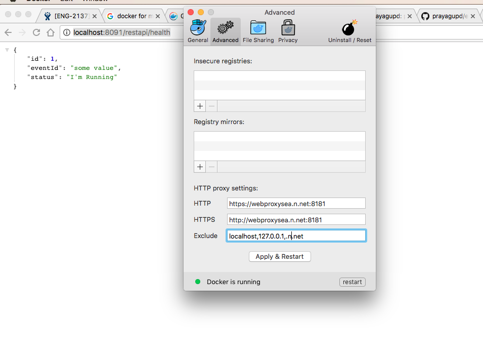

Java HTTP/REST micro-service
==========================

This is a micro-service baseline in java 12, spring-boot `2.1.x`

```
|                   |                          |
|                   |                          |
|    /endpoint      |      service             |
|                   |                          |
|                   |                          |
|                   |                          |

```


- [tests](#tests)
- [build/ run-app in x env](#run-app-in-x-env)
- [Deployment + Load balancing](#Deployment-+-Load-balancing)
- [build artifact](#build-artifact)
- [perf](#perf)

tests
-----

```bash
mvn test
```

build/ [run-app in x env](http://docs.spring.io/spring-boot/docs/current/maven-plugin/examples/run-profiles.html)
----------------------------------------------------------------------------------------------------------

[with `application.properties` configured to `e2e`](http://stackoverflow.com/a/35757421/432903)

```bash

spring.profiles.active=e2e

mvn spring-boot:run
```

or set profile in `pom.xml`.

[BUT the best way is to have environment variable](http://stackoverflow.com/a/35534970/432903),
[that will determine which config to use.](http://stackoverflow.com/a/38337109/432903)

```
export SPRING_PROFILES_ACTIVE=production
```

or

```bash
export APP_ENVIRONMENT=production
spring.profiles.active=${APP_ENVIRONMENT} ##not necessary
```

```bash
curl -v -XGET http://localhost:8080/restapi/health | python -m json.tool
Note: Unnecessary use of -X or --request, GET is already inferred.
* TCP_NODELAY set
* Connected to localhost (::1) port 8080 (#0)
> GET /health HTTP/1.1
> Host: localhost:8080
> User-Agent: curl/7.54.0
> Accept: */*
> 
< HTTP/1.1 200 
< Content-Type: application/json;charset=UTF-8
< Transfer-Encoding: chunked
< Date: Mon, 08 Jul 2019 03:24:47 GMT
< 
{ [89 bytes data]
100    83    0    83    0     0   3134      0 --:--:-- --:--:-- --:--:--  3192
* Connection #0 to host localhost left intact
{
    "applicationName": "rest-api",
    "applicationVersion": "1.0",
    "timestamp": 1562556287580
}
```

or using docker (setup the HTTP_PROXY, HTTPS_PROXY and NO_PROXY)




```bash
mvn clean package
eval $(minikube docker-env) # instead of pushing your Docker image to a registry, you can simply build the image using the same Docker host as the Minikube VM
docker build -t rest-server:v1 .
#docker run -it --rm -p 9000:8080 rest-server:v1

# kubectl apply -f k8s-nodes.yaml
kubectl create -f restserver-k8-service.yaml
#kubectl delete service rest-server

kubectl create -f restserver-k8-deployemnt.yaml
#kubectl delete deployment rest-server

kubectl get services
NAME          TYPE        CLUSTER-IP      EXTERNAL-IP   PORT(S)          AGE
kubernetes    ClusterIP   10.96.0.1       <none>        443/TCP          2d
rest-server   NodePort    10.102.228.53   <none>        8080:30035/TCP   5m

minikube service rest-server #expose your Service outside of the cluster
```

https://github.com/redhat-developer-demos/spring-boot-configmaps-demo

Publish artifact/ container image
---------------------------

```
docker tag rest-server:v1 ???.dkr.ecr.us-east-1.amazonaws.com/???-dev
aws ecr get-login --no-include-email --profile ???-dev --region us-east-1
docker login -u AWS -p <<password>>  https://???.dkr.ecr.us-east-1.amazonaws.com

docker push <aws_account_id>.dkr.ecr.us-east-1.amazonaws.com/duwamish-repository

kubectl apply -f deployment.yaml
```


REST API deps size

```bash
$ du -sh target/restapi/WEB-INF/lib/spring-*
372K	target/restapi/WEB-INF/lib/spring-aop-4.3.6.RELEASE.jar
748K	target/restapi/WEB-INF/lib/spring-beans-4.3.6.RELEASE.jar
648K	target/restapi/WEB-INF/lib/spring-boot-1.4.4.RELEASE.jar
952K	target/restapi/WEB-INF/lib/spring-boot-autoconfigure-1.4.4.RELEASE.jar
4.0K	target/restapi/WEB-INF/lib/spring-boot-starter-1.4.4.RELEASE.jar
4.0K	target/restapi/WEB-INF/lib/spring-boot-starter-logging-1.4.4.RELEASE.jar
4.0K	target/restapi/WEB-INF/lib/spring-boot-starter-tomcat-1.4.4.RELEASE.jar
4.0K	target/restapi/WEB-INF/lib/spring-boot-starter-web-1.4.4.RELEASE.jar
1.1M	target/restapi/WEB-INF/lib/spring-context-4.3.6.RELEASE.jar
1.1M	target/restapi/WEB-INF/lib/spring-core-4.3.6.RELEASE.jar
260K	target/restapi/WEB-INF/lib/spring-expression-4.3.6.RELEASE.jar
800K	target/restapi/WEB-INF/lib/spring-web-4.3.6.RELEASE.jar
896K	target/restapi/WEB-INF/lib/spring-webmvc-4.3.6.RELEASE.jar
```

Deployment + Load balancing
-----

//TODO using k8s

[perf](perf.md)
----


Also see :

https://github.com/prayagupd/onlywallet-nodejs

