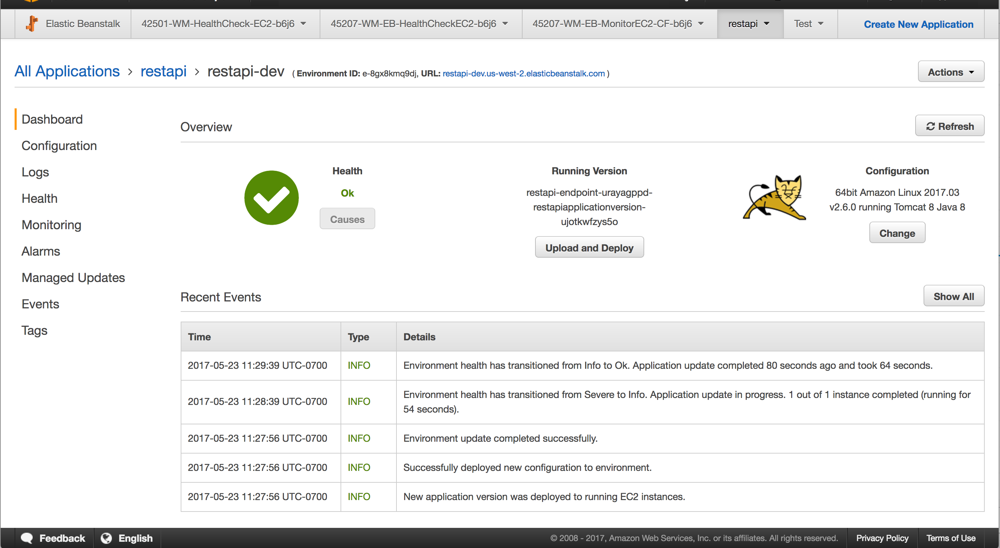

Java REST Server
================

The project is created using `maven-archetype-webapp`.

```
|                   |                          |
|                   |                          |
|    /endpoint      |      Service             |
|                   |                          |
|                   |                          |
|                   |                          |

```


tests
-----

```
mvn test
```

[run-app in x env](http://docs.spring.io/spring-boot/docs/current/maven-plugin/examples/run-profiles.html)
-------

```bash
mvn spring-boot:run -Drun.jvmArguments="-Dspring.profiles.active=staging"
```

or set profile in `pom.xml`.

```
curl -XGET http://localhost:9000/restapi/health

{
"id": 1,
"eventId": "some value",
"status": "I'm Running"
}

```

Or, build a war and deploy to tomcat http server, contextPath would be taken from `finalName`.

```
mvn clean package
```

or using docker (setup the HTTP_PROXY, HTTPS_PROXY and NO_PROXY)


```
docker build -t restapi .
docker run -it --rm -p 9000:8080 restapi
```

Deployment + Load balancing
---------------------------

build artifact
--------------

```
mvn clean package
```

https://aws.amazon.com/elasticbeanstalk/getting-started/

http://docs.aws.amazon.com/elasticbeanstalk/latest/dg/java-getstarted.html

https://docs.aws.amazon.com/elasticbeanstalk/latest/dg/eb-cli3-install.html?icmpid=docs_elasticbeanstalk_console


