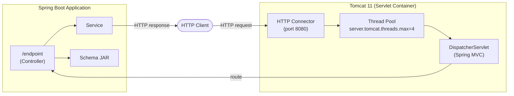

# Java HTTP/REST Micro-service


A micro-service implementation in Java 21, Spring Boot `4.0.x`.


```mermaid
flowchart LR

    subgraph springboot["Spring Boot Application"]
        direction TB
        endpoint["/endpoint\n(Controller)"]
        service["Service"]
        schema["Schema JAR"]
        endpoint --> service
        endpoint --> schema
    end
    
    subgraph tomcat["Tomcat 11 (Servlet Container)"]
        direction TB
        connector["HTTP Connector\n(port 8080)"]
        threadpool["Thread Pool\nserver.tomcat.threads.max=4"]
        dispatcher["DispatcherServlet\n(Spring MVC)"]
        connector --> threadpool --> dispatcher
    end

    client(["HTTP Client"])
    
    client -->|"HTTP request"| connector
    dispatcher -->|"route"| endpoint
    service -->|"HTTP response"| client
```

---

## Table of Contents

- [Unit Tests](#unit-tests)
- [Run Application](#run-application)
  - [Environment Profiles](#environment-profiles)
  - [Verify the Endpoint](#verify-the-endpoint)
- [Build Artifact](docs/artifact.md)
- [App Start Time](#app-start-time)
- [Monitoring](docs/monitoring.md)
- [Build & Run in Docker (Single Core)](docs/build-and-run.md)
- [Deployment & Load Balancing](devops/README.md)
- [Performance](docs/perf/README.md)
- [See Also](#see-also)

---

## Unit Tests

```bash
## using gradle build tool
./gradlew clean test

## using maven
## mvn test
```

---

## Run Application

Application can be run with different profiles. In a typical development cycle, a software goes through
multiple environments — local, dev, test, stage/prod-like, and finally production.

Environment-specific configuration is stored in properties files under `src/main/resources`.

### Environment Profiles

[Configuring `application.properties` with a profile](http://stackoverflow.com/a/35757421/432903)

```bash
export SPRING_PROFILES_ACTIVE=dev
## or set spring.profiles.active=dev in application.properties
./gradlew run

## You will see logs mentioning the active profile
#2022-12-29 20:13:37.946  INFO INFOid --- [           main] c.a.RESTApplication : The following profiles are active: dev
```

In higher environments, the infrastructure team typically sets an environment variable that can be
mapped to `spring.profiles.active`:

```bash
## If environment machines have env APP_ENVIRONMENT available
export APP_ENVIRONMENT=production
## assign the value of APP_ENVIRONMENT to spring.profiles.active
## in application.properties
spring.profiles.active=${APP_ENVIRONMENT}
```

### Verify the Endpoint

```bash
curl -v -XGET http://127.0.0.1:8080/retailstore/health-blocking | python -m json.tool
Note: Unnecessary use of -X or --request, GET is already inferred.
*   Trying 127.0.0.1:8080...
> GET /retailstore/health-blocking HTTP/1.1
> Host: localhost:8080
> User-Agent: curl/7.79.1
> Accept: */*
>
* Mark bundle as not supporting multiuse
< HTTP/1.1 200
< Content-Type: application/json
< Transfer-Encoding: chunked
< Date: Fri, 30 Dec 2022 21:55:50 GMT
<
{ [94 bytes data]
* Connection #0 to host localhost left intact
{
    "timestamp": 1672433750,
    "applicationName": "retailstore-rest",
    "applicationVersion": "1.0"
}
```

---

## App Start Time

| Java | Spring Boot | Startup |
|------|-------------|---------|
| 21   | 4.0.0       | 695 ms  |


---

## See Also

- https://github.com/parayaluyanta/retailstore-microservice-nio (`~6.978ms/request`)
- https://github.com/lamatola-os/chat-server_reactive-spring (`~22.860ms/request`)
- https://github.com/lamatola-os/akka-http-benchmark (`~1.172ms/request`)
- https://github.com/lamatola-os/netty-microservice (`~1.280ms/request`)
- https://github.com/prayagupd/nodejs-microservice
