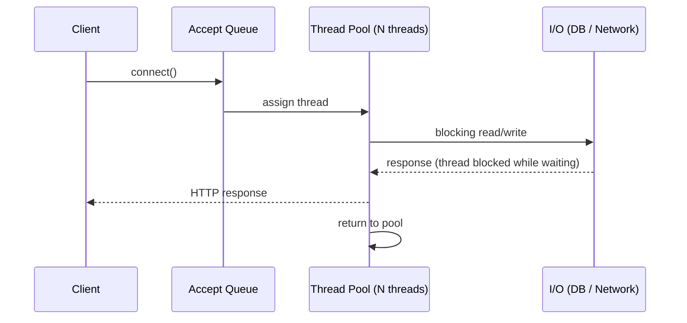
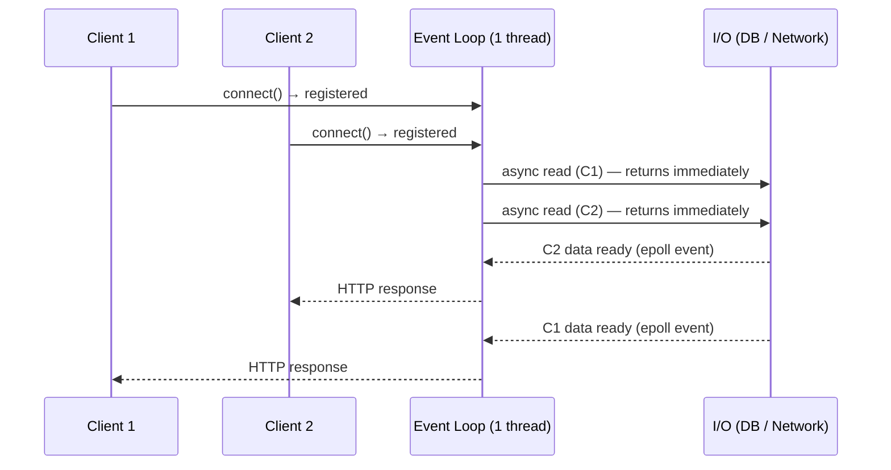
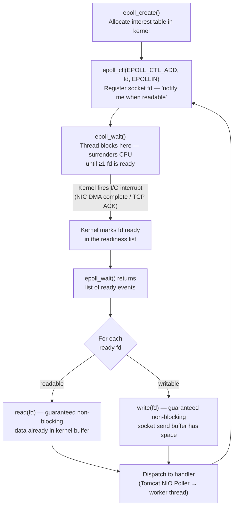
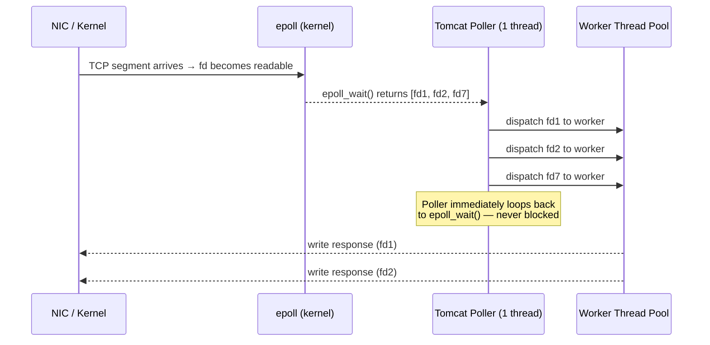

# Web Server Concurrency Models

A technical reference for understanding the performance characteristics of blocking and
non-blocking I/O models as they apply to this service's benchmark results.

---

## Blocking (Thread-Per-Request) Model

Each inbound connection is assigned a dedicated OS thread for its full lifetime. The thread
is unavailable to serve other requests until the response is flushed and the connection is
released back to the pool.

**Characteristics:**

| Property | Behaviour |
|----------|-----------|
| Max parallelism | Bounded by thread pool size (`server.tomcat.threads.max`) |
| Memory per connection | ~1 MB stack per OS thread |
| Context switching | O(N) kernel scheduler overhead under high concurrency |
| Backpressure | Requests queue in `accept-count` buffer; surplus connections are refused |
| CPU efficiency | Poor — thread is parked (sleeping) during all I/O wait, wasting its time slice |

**Failure mode — thread starvation:**  
When all threads are occupied and the accept queue (`server.tomcat.accept-count`) is full,
new connections are dropped. This is exploited by slow-loris style attacks, where a single
client holds connections open by sending HTTP headers one byte per second, exhausting the
thread pool with minimal bandwidth.

See [2023 benchmark results](java12/Tomcat_default_200_threads_1_CPU.md) for empirical evidence:
throughput collapsed from ~3 950 req/s at 10K requests to ~391 req/s at 100K on a single CPU,
with p99 exceeding 1 second — a direct consequence of pool saturation.

---

## Non-Blocking (Event-Loop) Model

A small, fixed number of threads multiplex thousands of concurrent connections using
kernel-level I/O event notification (`epoll` on Linux, `kqueue` on macOS). Threads never
block — they register interest in I/O events and are immediately available to handle the
next ready event.

**Characteristics:**

| Property | Behaviour |
|----------|-----------|
| Max parallelism | Unbounded — limited by file descriptor limits, not thread count |
| Memory per connection | ~few KB kernel socket buffer; no per-connection thread stack |
| Context switching | Near-zero — user-space event dispatch, no kernel thread scheduling |
| Backpressure | Flow-controlled at the socket level; no fixed accept queue ceiling |
| CPU efficiency | High — thread is always executing useful work |

**Trade-off — CPU-bound workloads:**  
If a handler performs CPU-intensive work (e.g. JSON serialisation of large payloads,
cryptographic operations) it blocks the event loop, starving all other connections on that
thread. The mitigation is offloading CPU work to a separate executor (virtual threads in
Java 21, `subscribeOn` in Project Reactor, `@Async` thread pools).

See [2026 benchmark results](java21/README.md): with Java 21 + Tomcat 11 NIO and HTTP
Keep-Alive, the same single-CPU container sustains **~22K req/s at 100K requests** —
a 56× improvement over the 2023 blocking results.

---

## How `epoll` / `kqueue` Works

Both `epoll` (Linux) and `kqueue` (macOS/BSD) are kernel subsystems that let a single
user-space thread monitor thousands of file descriptors (sockets, pipes, files) simultaneously,
without polling or blocking on any individual one.

### Lifecycle

### Key Kernel Mechanisms

| Mechanism | Description |
|-----------|-------------|
| **Interest table** | A red-black tree in kernel space mapping `fd → event mask`. `epoll_ctl` O(log n) insert/delete. |
| **Readiness list** | A linked list of fds that have become ready since the last `epoll_wait`. O(1) traversal — you only see *ready* fds, never scan all. |
| **Edge-triggered (ET)** | Notified once when fd transitions from not-ready to ready. Requires draining the fd completely; missed reads cause silent stalls. |
| **Level-triggered (LT)** | Notified on every `epoll_wait` call while fd remains ready. Safer default; used by Tomcat NIO and most JVM frameworks. |
| **`kqueue` (macOS/BSD)** | Equivalent API — `kevent()` replaces `epoll_ctl`/`epoll_wait`. Supports file, process, signal, and timer events in addition to sockets. |

### Why This Matters for Tomcat NIO

A single Poller thread can handle tens of thousands of concurrent keep-alive connections
because it never blocks — it only calls `epoll_wait`, hands ready connections to the worker
pool, and immediately returns to waiting. The [2026 benchmarks](java21/README.md) sustain
**~22K req/s** on a single CPU using exactly this model.

---

## Choosing a Model

| Workload | Recommended model | Rationale |
|----------|-------------------|-----------|
| High I/O concurrency, low CPU per request | Non-blocking / event loop | Maximises thread utilisation; no pool ceiling |
| CPU-intensive per request | Blocking thread pool | Predictable latency; no event-loop starvation risk |
| Mixed (I/O + moderate CPU) | Virtual threads (Java 21+) | OS-thread-like programming model with NIO scheduling |
| Bursty, unpredictable traffic | Non-blocking + backpressure | Reactive streams prevent unbounded memory growth |

Java 21 virtual threads (`Thread.ofVirtual()`) blur this boundary: they present a
synchronous, blocking API to the developer while the JVM scheduler parks them on carrier
threads during I/O — effectively delivering non-blocking throughput without callback-driven
code.

---

## References

- [StackOverflow — Blocking vs Non-Blocking I/O](https://stackoverflow.com/a/56808576/432903)
- [Twitter Engineering — Search 3× faster with NIO](https://blog.twitter.com/engineering/en_us/a/2011/twitter-search-is-now-3x-faster)
- [Tomcat Connector Architecture](https://tomcat.apache.org/tomcat-11.0-doc/config/http.html)
- [JEP 444 — Virtual Threads (Java 21)](https://openjdk.org/jeps/444)
- [The C10K Problem — Dan Kegel](http://www.kegel.com/c10k.html)
