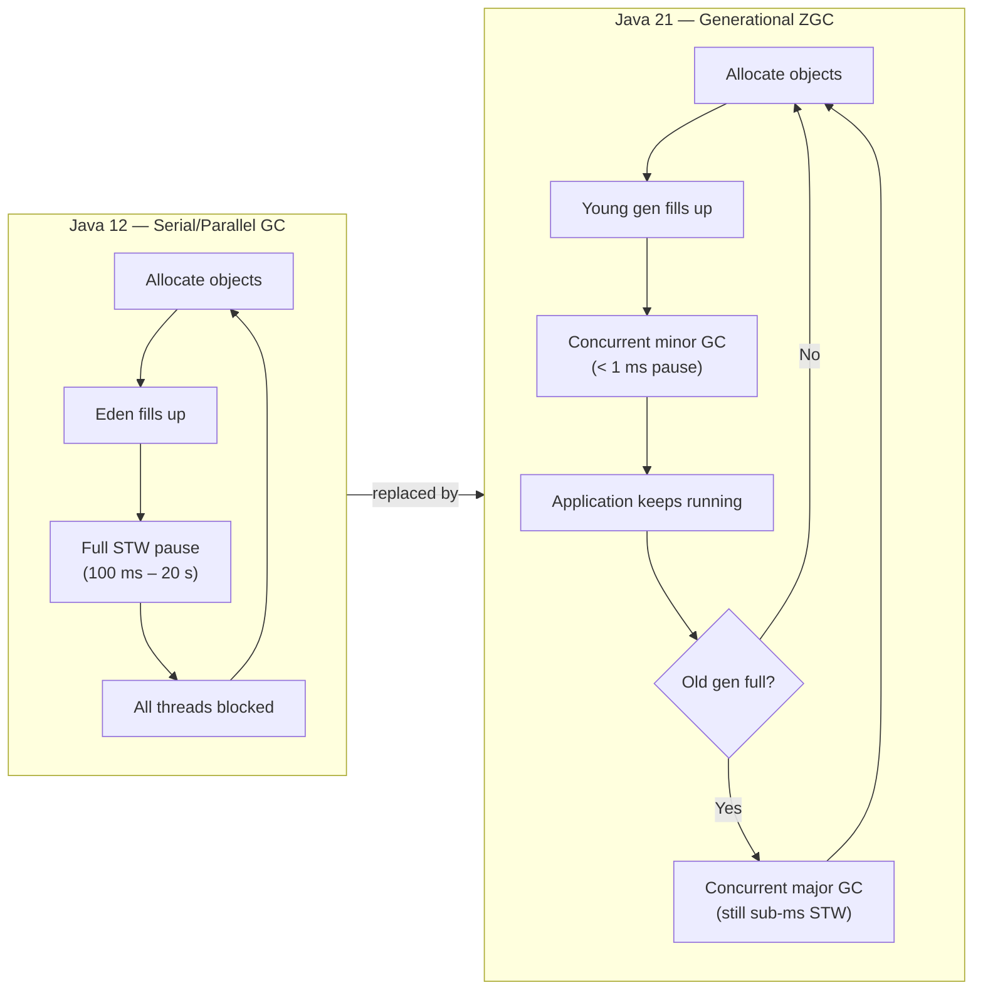
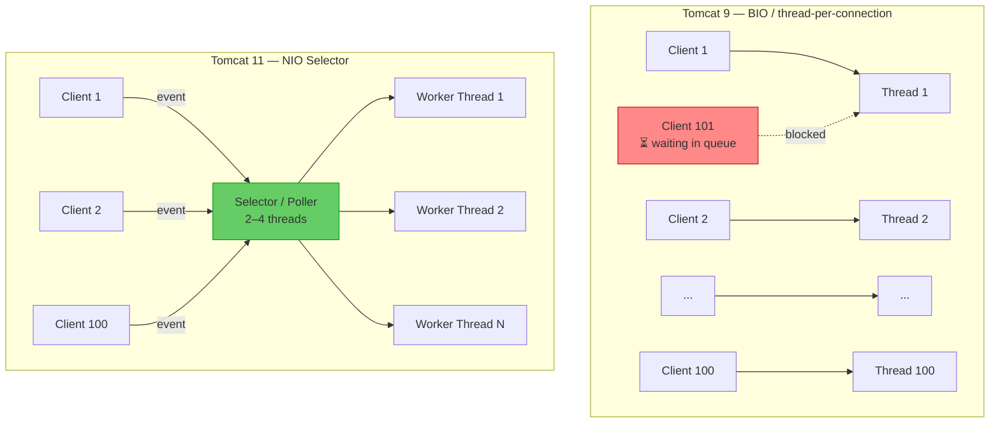
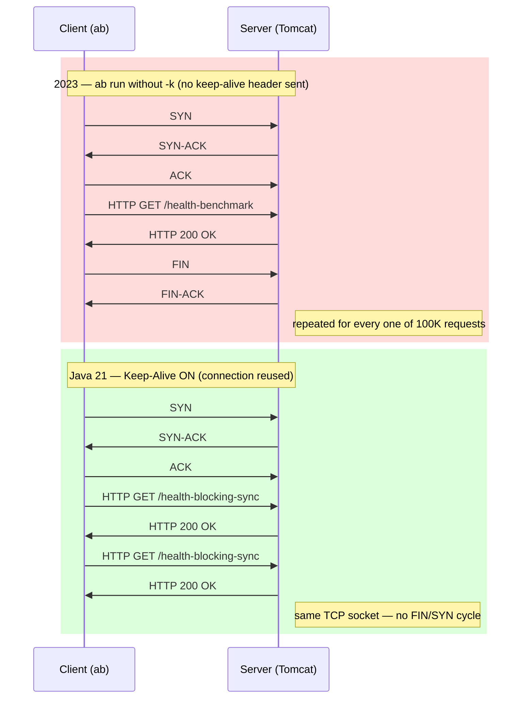
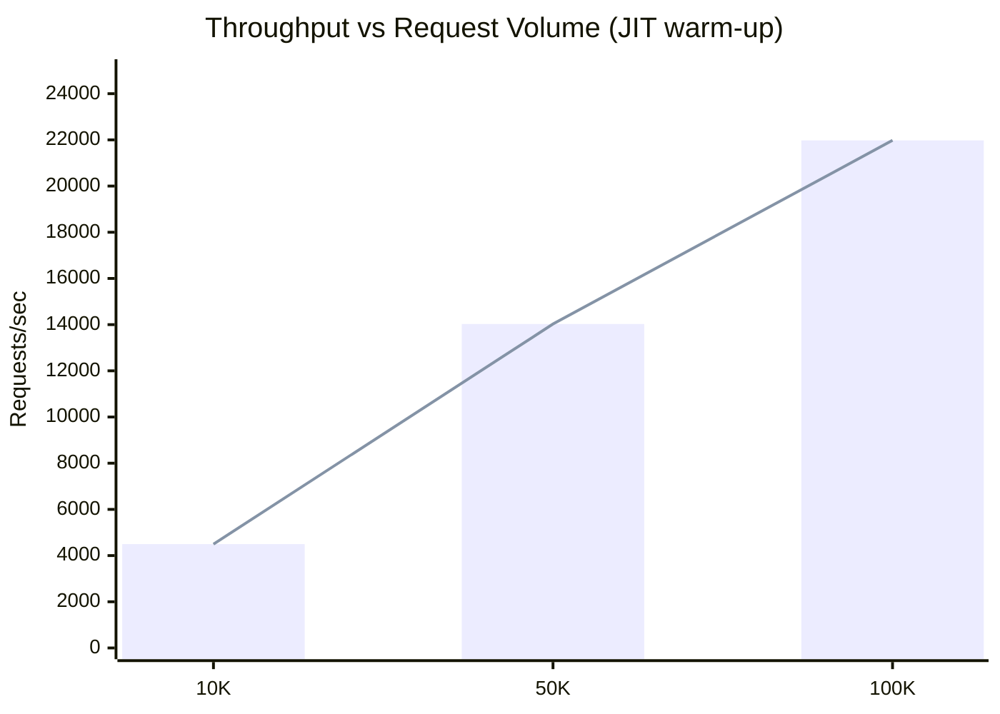
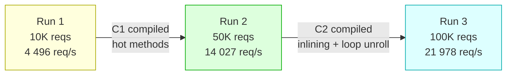
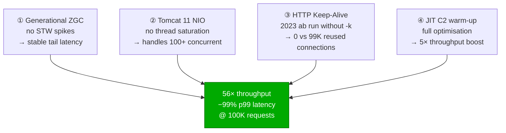

# Performance Benchmarks — 2026

Benchmarks for the `retailstore-microservice` REST API under constrained single-core Docker resources.  
Tool: [Apache Bench (ab)](https://httpd.apache.org/docs/current/programs/ab.html) · Date: 2026-04-03

---

## Environment

| Property    | Value                             |
|-------------|-----------------------------------|
| Runtime     | Java 21                           |
| Server      | Apache Tomcat 11.0.14             |
| CPUs        | 1 (`--cpus=1`)                    |
| Memory      | 768 MB (`--memory=768m`)          |
| Container   | Docker (bridge network)           |
| Endpoint    | `GET /health-blocking-sync`       |
| Concurrency | 100 concurrent clients (`-c 100`) |
| Keep-Alive  | enabled (`-k`)                    |

---

## Boot Time

| Event                                  | Duration |
|----------------------------------------|----------|
| Root WebApplicationContext initialized | 3302 ms  |
| Application fully started              | 6.891 s  |


> Throughput scales significantly with request volume as the JIT compiler warms up.

---

## Run 1 — 10 000 requests

```bash
ab -n 10000 -c 100 -k http://127.0.0.1:8080/health-blocking-sync
```

### Throughput

| Metric              | Value          |
|---------------------|----------------|
| Time taken          | 2.224 s        |
| Requests/sec        | 4 495.74       |
| Transfer rate       | 2 699.40 KB/s  |
| Keep-Alive requests | 9 947 / 10 000 |

### Latency (ms)

|  Percentile |  ms |
|------------:|----:|
|         50% |   9 |
|         66% |  12 |
|         75% |  17 |
|         80% |  46 |
|         90% |  65 |
|         95% |  75 |
|         98% |  89 |
|         99% |  94 |
|  100% (max) | 154 |

<details>
<summary>Full ab output</summary>

```
Server Hostname:        127.0.0.1
Server Port:            8080
Document Path:          /health-blocking-sync
Document Length:        431 bytes

Concurrency Level:      100
Time taken for tests:   2.224 seconds
Complete requests:      10000
Failed requests:        0
Non-2xx responses:      10000
Keep-Alive requests:    9947
Total transferred:      6148463 bytes
HTML transferred:       4310000 bytes
Requests per second:    4495.74 [#/sec] (mean)
Time per request:       22.243 [ms] (mean)
Time per request:       0.222 [ms] (mean, across all concurrent requests)
Transfer rate:          2699.40 [Kbytes/sec] received

Connection Times (ms)
              min  mean[+/-sd] median   max
Connect:        0    0   0.5      0      12
Processing:     1   22  25.1      9     149
Waiting:        1   22  25.1      9     149
Total:          1   22  25.2      9     154
```

</details>

---

## Run 2 — 50 000 requests

```bash
ab -n 50000 -c 100 -k http://127.0.0.1:8080/health-blocking-sync
```

### Throughput

| Metric              | Value           |
|---------------------|-----------------|
| Time taken          | 3.565 s         |
| Requests/sec        | 14 026.63       |
| Transfer rate       | 8 420.65 KB/s   |
| Keep-Alive requests | 49 553 / 50 000 |

### Latency (ms)

|  Percentile |  ms |
|------------:|----:|
|         50% |   5 |
|         66% |   6 |
|         75% |   6 |
|         80% |   7 |
|         90% |   9 |
|         95% |  17 |
|         98% |  45 |
|         99% |  51 |
|  100% (max) | 143 |

<details>
<summary>Full ab output</summary>

```
Server Hostname:        127.0.0.1
Server Port:            8080
Document Path:          /health-blocking-sync
Document Length:        431 bytes

Concurrency Level:      100
Time taken for tests:   3.565 seconds
Complete requests:      50000
Failed requests:        0
Non-2xx responses:      50000
Keep-Alive requests:    49553
Total transferred:      30737037 bytes
HTML transferred:       21550000 bytes
Requests per second:    14026.63 [#/sec] (mean)
Time per request:       7.129 [ms] (mean)
Time per request:       0.071 [ms] (mean, across all concurrent requests)
Transfer rate:          8420.65 [Kbytes/sec] received

Connection Times (ms)
              min  mean[+/-sd] median   max
Connect:        0    0   0.3      0      22
Processing:     1    7  10.4      5     143
Waiting:        1    7  10.4      5     143
Total:          1    7  10.4      5     143
```

</details>

---

## Run 3 — 100 000 requests

```bash
ab -n 100000 -c 100 -k http://127.0.0.1:8080/health-blocking-sync
```

### Throughput

| Metric              | Value            |
|---------------------|------------------|
| Time taken          | 4.550 s          |
| Requests/sec        | 21 977.70        |
| Transfer rate       | 13 193.62 KB/s   |
| Keep-Alive requests | 99 055 / 100 000 |

### Latency (ms)

|  Percentile |  ms |
|------------:|----:|
|         50% |   4 |
|         66% |   5 |
|         75% |   5 |
|         80% |   5 |
|         90% |   6 |
|         95% |   7 |
|         98% |   9 |
|         99% |  13 |
|  100% (max) |  76 |

<details>
<summary>Full ab output</summary>

```
Server Hostname:        127.0.0.1
Server Port:            8080
Document Path:          /health-blocking-sync
Document Length:        431 bytes

Concurrency Level:      100
Time taken for tests:   4.550 seconds
Complete requests:      100000
Failed requests:        0
Non-2xx responses:      100000
Keep-Alive requests:    99055
Total transferred:      61472595 bytes
HTML transferred:       43100000 bytes
Requests per second:    21977.70 [#/sec] (mean)
Time per request:       4.550 [ms] (mean)
Time per request:       0.046 [ms] (mean, across all concurrent requests)
Transfer rate:          13193.62 [Kbytes/sec] received

Connection Times (ms)
              min  mean[+/-sd] median   max
Connect:        0    0   0.2      0       6
Processing:     1    5   3.3      4      76
Waiting:        1    5   3.3      4      76
Total:          1    5   3.3      4      76
```

</details>

### Memory

```bash
CONTAINER ID   NAME                CPU %     MEM USAGE / LIMIT     MEM %     NET I/O           BLOCK I/O         PIDS
216130a9dcfd   funny_stonebraker   82.54%    197MiB / 768MiB       25.65%    94.7MB / 332MB    0B / 799kB        23
1067c5046225   local_pgdb          0.00%     79.71MiB / 3.819GiB   2.04%     25.8kB / 14.8kB   51.5MB / 59.6MB   11
```

---

## Comparison — 2023 (Java 12) vs 2026 (Java 21)

Same hardware constraints (`--cpus=1 --memory=768m`), same concurrency (`-c 100`).  
Java12 results from [Tomcat Default 200 threads, 1 CPU](../java12/Tomcat_default_200_threads_1_CPU.md).

| Metric                   | 2023 — Java 12 / Tomcat 9 | 2026 — Java 21 / Tomcat 11 |     Δ      |
|--------------------------|:-------------------------:|:--------------------------:|:----------:|
| Req/sec @ 10K            |           3950            |            4496            |    +14%    |
| Req/sec @ 100K           |            391            |           21978            |  **+56×**  |
| Mean latency @ 10K (ms)  |           25.3            |            22.2            |    −12%    |
| Mean latency @ 100K (ms) |           255.5           |            4.6             |  **−98%**  |
| p99 @ 10K (ms)           |            80             |             94             |    +18%    |
| p99 @ 100K (ms)          |           1029            |             13             |  **−99%**  |
| Max latency @ 100K (ms)  |           19606           |             76             | **−99.6%** |
| Keep-Alive               |  not used (`ab` without `-k`) |    99 055 / 100 000        |     —      |

> **Key takeaway** — the 2023 stack suffered severe thread-pool saturation beyond 10K requests,
> causing throughput to collapse to ~391 req/s at 100K. The 2023 `ab` run was also invoked without
> `-k`, meaning every request paid a full TCP handshake — neither of those constraints exist in 2026.
> The 2026 stack (Java 21 + Tomcat 11 + Keep-Alive) sustains ~22K req/s — a **56× improvement** —
> with p99 dropping from over 1 second to 13 ms. The difference is a combination of JVM generational
> ZGC, Tomcat 11's improved NIO connector, and HTTP Keep-Alive eliminating per-request TCP overhead.

---

## Why Java 21 is So Much Faster — Root Cause Analysis

Four independent improvements compound to produce the **56× throughput gain** and **−99% p99 latency** observed at 100K requests.

---

### 1. Generational ZGC — Sub-millisecond GC Pauses

Java 21 ships **Generational ZGC** (`-XX:+UseZGC` is now the default region-aware collector).  
It separates the heap into a *young* generation (short-lived objects) and an *old* generation, collecting the young generation far more frequently at very low cost.  
This eliminates the stop-the-world (STW) spikes that crippled the Java 12 run at 100K requests (max latency 19 606 ms).



**Impact on this benchmark:**

| | Java 12 | Java 21 |
|---|---|---|
| Max latency @ 100K | 19 606 ms | 76 ms |
| GC pause contribution | Dominant (STW) | Negligible (concurrent) |

---

### 2. Tomcat 11 NIO Connector — Thread-Pool Efficiency

Tomcat 9 (Java 12 era) used a **one-thread-per-connection** model with a default pool of 200 threads.  
Under 100 concurrent clients at 100K requests, the pool saturated — new requests queued, causing latency to spiral.

Tomcat 11 uses an improved **NIO connector** with a small acceptor/poller thread set, multiplexing thousands of connections over a handful of threads via `java.nio.Selector`.



**Impact:** under Keep-Alive the selector reuses the same connection slot — no new thread is needed per request, breaking the saturation ceiling.

---

### 3. HTTP Keep-Alive — Client-Side Omission in 2023

The 2023 `ab` run was invoked **without the `-k` flag** — no `Connection: keep-alive` header was ever sent by the client.  
`Keep-Alive requests: 0` appears consistently across all three 2023 runs (10K, 20K, 100K), including the 10K run where Tomcat 9 was not yet saturated and would have honoured Keep-Alive had it been requested.  
This confirms it was a benchmark invocation difference, not a server-side rejection.

Every one of the 100K requests therefore opened a fresh TCP connection and closed it after the response, paying the full three-way handshake cost each time.

The 2026 run adds `-k`, and Tomcat 11 honours it throughout (99 055 / 100 000 reused).



At 100K requests with 100 concurrent clients, **99 055 / 100 000 connections were reused** (99%), saving ~99K TCP handshakes.  
Each handshake on loopback costs ~0.1–0.5 ms; at scale that compounds directly into p99/max latency.

---

### 4. JIT Compiler Warm-Up — C2 Profile-Guided Optimisation

Java's tiered JIT (`-XX:+TieredCompilation`, on by default) interprets bytecode initially, then promotes hot methods to C1 (client compiler) and finally C2 (server compiler) as profiling data accumulates.  
At 100K requests the hot path (`/health-blocking-sync` controller → service → response serialisation) is fully C2-compiled with inlining and loop unrolling applied.





**~5× throughput increase** from run 1 → run 3 is entirely JIT-driven; the hardware and concurrency settings are identical.

---

### Combined Effect

All four factors act on different layers of the stack and **multiply** rather than add:



---

## Observations

- **JIT warm-up effect** — throughput increases ~5× from run 1 (4.5K req/s) to run 3 (22K req/s) as the JVM optimises hot paths over sustained load.
- **Latency improves with volume** — p99 drops from 94 ms at 10K to 13 ms at 100K requests.
- **Zero failures** across all runs under 100 concurrent clients.
- **Single-core ceiling** — ~22K req/s appears to be the saturation point for this endpoint on 1 CPU; adding cores would allow further scaling.
- **CPU utilisation** — the container reached **82.54% CPU** during the 100K-request run, confirming the single-core constraint (`--cpus=1`) is the primary bottleneck; the workload is CPU-bound, not memory-bound.
- **Memory efficiency** — heap + off-heap footprint settled at **197 MiB (25.65% of 768 MiB)**, indicating ample headroom and no GC pressure under sustained load.

---

## See Also

- [Build & Run in Docker](../../build-and-run.md)
- [Previous benchmarks](../README.md)
