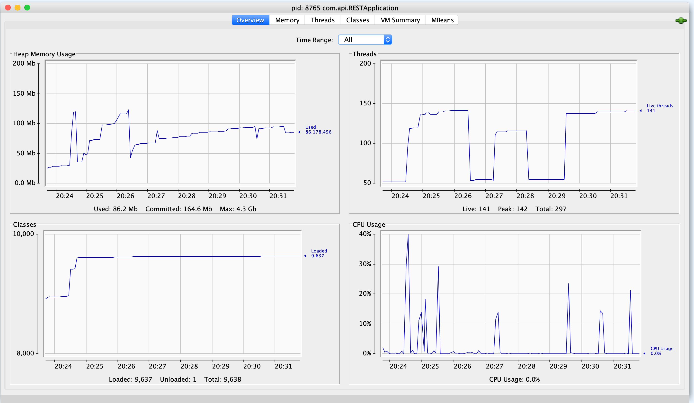

`13ms`

```bash
ab -n 10000 -c 100 -k http://127.0.0.1:8080/health
This is ApacheBench, Version 2.3 <$Revision: 1843412 $>
Copyright 1996 Adam Twiss, Zeus Technology Ltd, http://www.zeustech.net/
Licensed to The Apache Software Foundation, http://www.apache.org/

Benchmarking 127.0.0.1 (be patient)
Completed 1000 requests
Completed 2000 requests
Completed 3000 requests
Completed 4000 requests
Completed 5000 requests
Completed 6000 requests
Completed 7000 requests
Completed 8000 requests
Completed 9000 requests
Completed 10000 requests
Finished 10000 requests


Server Software:        
Server Hostname:        127.0.0.1
Server Port:            8080

Document Path:          /health
Document Length:        83 bytes

Concurrency Level:      100
Time taken for tests:   1.391 seconds
Complete requests:      10000
Failed requests:        0
Keep-Alive requests:    0
Total transferred:      1880000 bytes
HTML transferred:       830000 bytes
Requests per second:    7186.61 [#/sec] (mean)
Time per request:       13.915 [ms] (mean)
Time per request:       0.139 [ms] (mean, across all concurrent requests)
Transfer rate:          1319.42 [Kbytes/sec] received

Connection Times (ms)
              min  mean[+/-sd] median   max
Connect:        0    4   2.3      4      14
Processing:     1   10   3.0     10      24
Waiting:        1    7   2.5      7      21
Total:          5   14   3.6     14      29

Percentage of the requests served within a certain time (ms)
  50%     14
  66%     15
  75%     16
  80%     16
  90%     18
  95%     20
  98%     22
  99%     23
 100%     29 (longest request)
```

